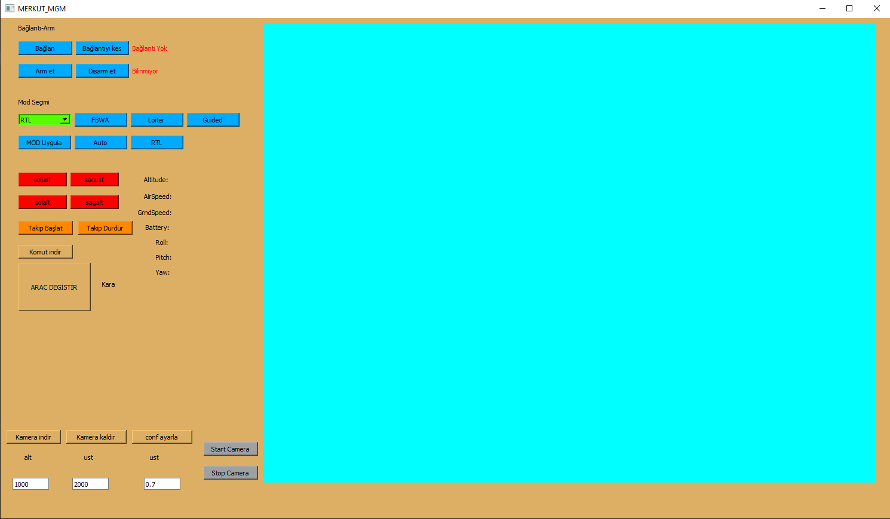

 I developed this application for 2023 Uluslararası İHA Competition. It contains locking and tracking unmanned aerical vehicle. I used PyQt5 to create an interface. I used dronekit to path planning and communication

